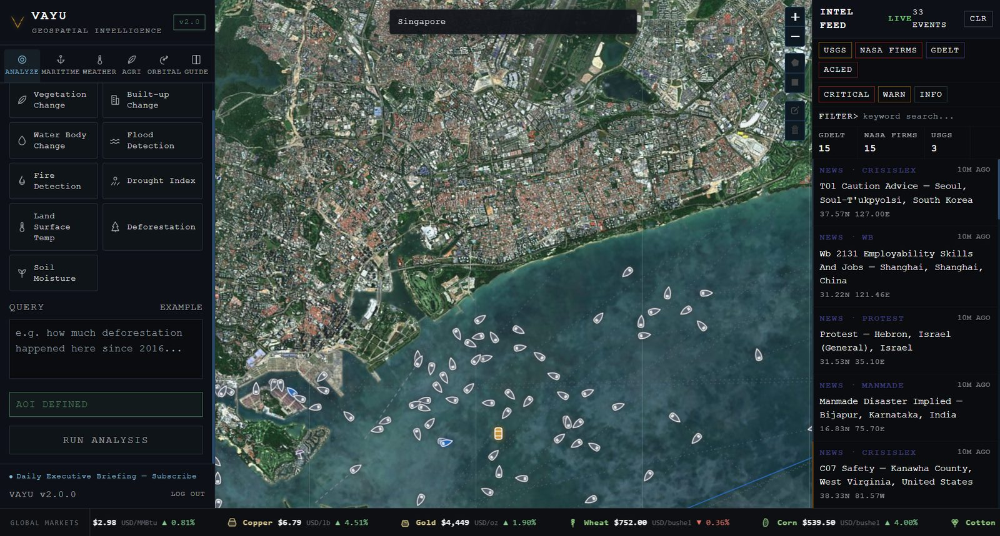
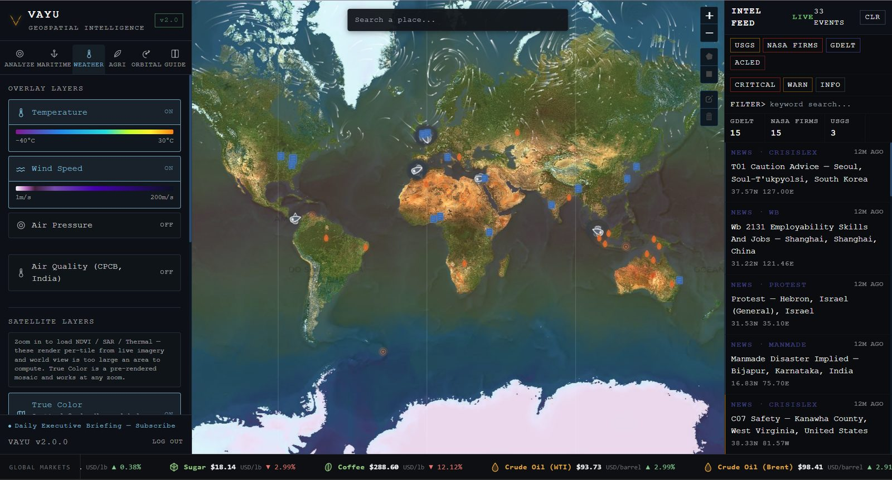
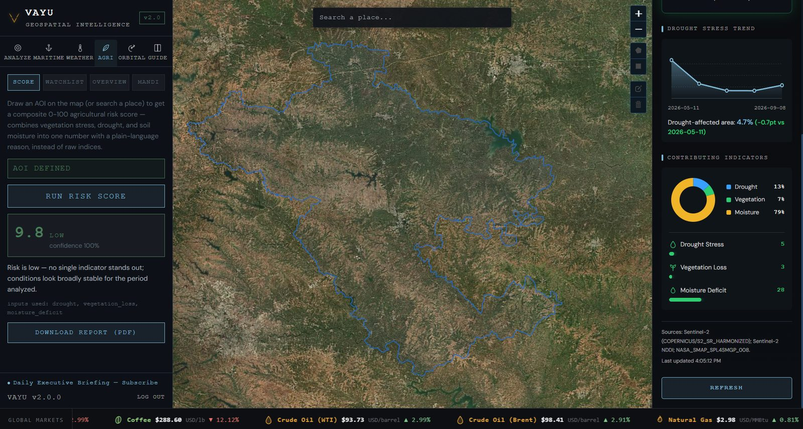
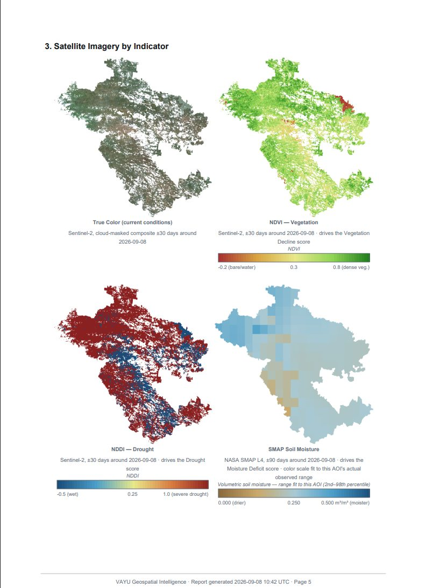
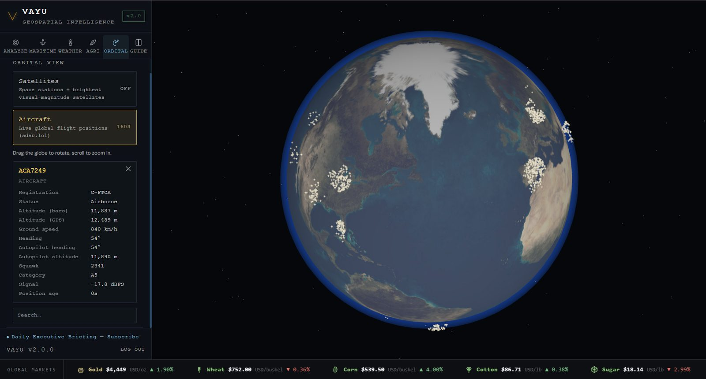

<p align="center">
  
</p>

<h1 align="center">VAYU</h1>
<p align="center"><b>Geospatial &amp; Business Intelligence Terminal</b></p>

<p align="center">
  <em>Satellite earth observation · remote sensing · maritime &amp; economic intelligence · agricultural risk scoring — unified in one live terminal.</em>
</p>

---

> **Abstract**
> Vayu is a web-based earth-observation and open-source-intelligence (OSINT) terminal that fuses **on-demand satellite analysis** over user-defined areas of interest with a **continuously streaming intelligence layer** — seismic activity, thermal anomalies, geolocated news, maritime traffic, commodity markets, and macroeconomic indicators. A dedicated **remote sensing toolkit** exposes the underlying spectral, radar, and terrain methods directly for domain researchers, while a **business intelligence layer** correlates chokepoint traffic, sanctions exposure, SEC disclosures, and economic-bloc data into a single auditable risk signal. An **agricultural risk module** applies the same satellite pipeline to a composite scoring engine with region monitoring and automated alerting.
>
> Every computed result states its source dataset, spatial resolution, and formula alongside the number — this is built to be checked, not just read.

---

## Table of Contents

1. [Access Model](#access-model)
2. [Satellite Earth Observation](#satellite-earth-observation)
3. [Remote Sensing Toolkit — Spectra](#remote-sensing-toolkit--spectra)
4. [Business Intelligence](#business-intelligence)
5. [Agricultural Risk Module](#agricultural-risk-module)
6. [Scientific PDF Reporting](#scientific-pdf-reporting)
7. [Real-Time Intelligence Feeds](#real-time-intelligence-feeds)
8. [Weather &amp; Orbital Layers](#weather--orbital-layers)
9. [Architecture](#architecture)
10. [Project Structure](#project-structure)
11. [Deployment &amp; Configuration](#deployment--configuration)
12. [API Reference](#api-reference)
13. [Data Source Attribution](#data-source-attribution)
14. [Known Constraints](#known-constraints)
15. [Licensing](#licensing)

---

## Access Model

The landing page routes into one of three scoped terminal configurations rather than a single undifferentiated view:

| Terminal | Tabs enabled | Intended for |
| --- | --- | --- |
| **Vayu Business** | Analyze, Business, Weather, Orbital | Markets, logistics, and macro/geopolitical analysis |
| **Vayu Agri** | Analyze, Weather, Agri | Agricultural risk monitoring and land condition |
| **Vayu Remote Sensing** | Analyze, Spectra, Weather | Domain remote sensing research (spectral/radar/terrain science) |
| **Vayu Full Terminal** | All six tabs | Unrestricted access |

Account/session infrastructure (email+password signup, service-tier field, password reset) is implemented against a Postgres backend but currently disabled in favor of the tier picker above for the MVP — see the in-code banner comments in `frontend/src/components/AppGate.jsx` and `backend/app/api/auth_endpoints.py` for the exact restoration path.

<p align="center">
  
  <br /><sub>Analyze tab — AOI-defined satellite analysis, live vessel tracking, and the multi-source Intel Feed. (Earlier build; current tab set and layout have since expanded — see below.)</sub>
</p>

---

## Satellite Earth Observation

**Tab: Analyze**

1. **Spatial definition** — draw an arbitrary GeoJSON Polygon/MultiPolygon AOI on the interactive canvas, or search a place by name.
2. **Natural-language translation** — free-text analytical queries (e.g. *"Show vegetation loss in this area from 2020-01-01 to 2024-01-01"*) are parsed by an LLM-orchestrated pipeline into a discrete metric and time window.
3. **Computation** — Google Earth Engine executes the corresponding raster analysis; results return as structured metrics plus a rendered map layer.
4. **Toggleable satellite basemap layers**, independent of the query pipeline: true color, NDVI, SAR, thermal/IR.

| Analysis | Dataset | Application |
| --- | --- | --- |
| Vegetation Dynamics | Sentinel-2 SR Harmonized (NDVI) | Canopy/green-cover variance screening |
| Urban Expansion | Google Dynamic World V1 | Built-up growth, gain/loss/unchanged change map |
| Hydrological Variance | JRC Global Surface Water | Surface-water persistence/depletion, gain/loss/unchanged change map |
| Radar Flood Detection | Sentinel-1 SAR GRD + JRC GSW + SRTM DEM | SAR flood-extent mapping through cloud cover, with permanent-water and steep-terrain exclusion |
| Thermal &amp; Burn Scarring | MODIS Burned Area / Active Fire | Burned-footprint and thermal-event detection |
| Vegetative Stress | Sentinel-2 NDDI | Drought-stress screening, area-normalized |
| Thermal Profiling | Landsat 8/9 TIRS (Collection 2) | Surface temperature, urban heat island detection |
| Forest-Cover Loss | Hansen Global Forest Change | Multi-year tree-cover loss tracking |
| Subsurface Hydrology | NASA SMAP L4 | Soil-moisture variance, area-normalized |

Each of these 9 analyses can be exported as a source-cited PDF — see [Scientific PDF Reporting](#scientific-pdf-reporting).

---

## Remote Sensing Toolkit — Spectra

**Tab: Spectra**

A direct-access toolkit for domain researchers (IIRS/NRSC/ISRO-adjacent workflows) who need the underlying spectral/radar/terrain building blocks rather than a pre-packaged natural-language answer. Pick a tool, an AOI, and a date range; every result states its dataset, resolution, and formula alongside the numbers.

| Tool | Method | Dataset · Resolution |
| --- | --- | --- |
| **Spectral Indices** | NDVI (Rouse 1974), NDWI (McFeeters 1996), MNDWI (Xu 2006), NDBI (Zha et al. 2003), SAVI (Huete 1988), EVI (Huete et al. 2002), NDSI (Hall et al. 1995) | Sentinel-2 SR Harmonized, cloud-masked median composite · 10-20 m |
| **Terrain Analysis** | Elevation, slope, aspect. Aspect is circular data (0°≡360°) and is averaged via a unit-vector circular mean, not a naive arithmetic mean | Copernicus DEM GLO-30 (TanDEM-X-derived) · 30 m |
| **Land Cover Classification** | 11-class area breakdown (tree cover, cropland, built-up, water, wetland, mangrove, etc.) | ESA WorldCover v200, 76.7% validated overall accuracy · 10 m, 2021 |
| **Snow Cover** | NDSI &gt; 0.4 classification threshold (Hall et al. 1995 — the same threshold MODIS's operational snow product uses) | Sentinel-2 SR · 20 m — resolves individual Himalayan valley glaciers far better than MODIS's native 500 m |
| **SAR Backscatter** | VV/VH backscatter (dB) + Radar Vegetation Index. RVI is computed on *linear* backscatter power after converting from dB — a ratio of decibel values is not the same physical quantity as a ratio of the underlying power | Sentinel-1 GRD, dual-pol IW mode, all-weather day/night · 20 m |

---

## Business Intelligence

**Tab: Business** — a wide, collapsible bottom panel with three sub-views (Live / Analysis / Economics), built specifically because cramming this much into a narrow sidebar made it unreadable.

### Live

* **Unified 0-100 business risk score** per monitored chokepoint (Strait of Hormuz, Strait of Malacca, Bab-el-Mandeb, Suez Canal, Strait of Gibraltar, Panama Canal, English Channel) — a deterministic, fully auditable weighted blend: 40% vessel-traffic anomaly (14-day rolling baseline z-score), 20% regional GDELT tone, 20% seismic proximity, 20% OFAC sanctions hits. No opaque model; every component and its weight is shown.
* **Dark-vessel (AIS-gap) detection** — flags vessels that stop transmitting AIS near a chokepoint and reappear elsewhere, further than plausible continuous transit would explain — a known sanctions-evasion/smuggling signature. Pure logic on the existing AIS stream, with a mass-disappearance guard so a bridge reconnect isn't mistaken for real gaps.
* **OFAC sanctions screening** — currently tracked vessels matched by name against the US Treasury SDN list (name-only match, disclosed as such — AIS provides MMSI+name, not IMO number).
* **Macro context** — US (FRED: fed funds rate, CPI, 10-year Treasury), Global, and India (World Bank: GDP growth, inflation) side by side.
* **Regional tone** — GDELT news coverage aggregated into geographic hotspots, most-negative-first, with sample headlines.
* **SEC exposure (EDGAR)** — on-demand full-text search of recent 8-K/10-K/10-Q filings mentioning a selected chokepoint.

### Analysis

Historical charting for everything above that was previously current-value-only — commodities (Yahoo Finance chart API, 1M-5Y), US macro (FRED), Global/India macro (World Bank), and chokepoint vessel-traffic history (accumulated automatically every 15 minutes). Rendered with a dependency-free SVG chart: real Y-axis, multiple X-axis date markers, and a hover crosshair/tooltip showing the exact value at any point.

### Economics

G7 / G20 / BRICS / ASEAN bloc analysis, each with:
* **Macro rollup** — GDP growth + inflation for every member country (World Bank, fetched in parallel).
* **Regional tone** — GDELT coverage filtered by bloc/member-country name.
* **Commodity relevance** — which tracked commodities this bloc's members are major producers/exporters of. Explicitly editorial (not API-sourced); every entry carries its reasoning inline so it is reviewable rather than presented as fact.
* **SEC exposure** — EDGAR full-text search for the bloc's own name.

### Strategic sites

64 major ports, oil refineries, and mines (curated, hand-maintained — see `strategic_sites.py`), plotted on the map with live proximity-based signals (nearby earthquakes, dark-vessel flags, regional tone) **and** actual recent news headlines within 150 km, shown on hover with source, timestamp, and a direct link.

<p align="center">
  
  <br /><sub>Weather tab — temperature, wind, air-quality overlays, with the live commodity ticker along the bottom.</sub>
</p>

---

## Agricultural Risk Module

**Tab: Agri** — a composite risk-scoring layer built on the same satellite pipeline, purpose-built for repeat monitoring of specific regions rather than one-off queries.

* **Composite 0-100 risk score** combining drought (NDDI), vegetation decline (NDVI threshold change), and soil-moisture deficit (SMAP) as a weighted average (40/35/25%), automatically renormalized if any indicator is unavailable.
* **Regional environmental context** — groundwater trend (GRACE), rainfall anomaly vs. a 10-year seasonal normal (CHIRPS), and land surface temperature (Landsat), reported separately from the composite score due to differing spatial resolution/timescale.
* **5-year seasonal NDVI baseline** — flags whether current conditions are unusual for that time of year at that location.
* **Region watchlist** with a farmer/officer feedback loop — confidence blends data completeness with the region's actual historical alert accuracy.
* **Automated alert engine** and **WhatsApp bot** for last-mile delivery.
* **Mandi (market) price** and **groundwater trend** overlays (data.gov.in / GRACE).

<p align="center">
  
  <br /><sub>Agri tab — composite risk score, contributing-indicator breakdown, and drought-trend chart for a drawn AOI.</sub>
</p>

---

## Scientific PDF Reporting

Every satellite analysis (the 9 Analyze-tab metrics and the agricultural risk score) exports as a structured PDF, not raw numbers:

* Executive summary, study-area geometry, full methodology with a worked numeric example, indicator definitions and thresholds, results table, findings &amp; interpretation, data-quality/confidence section, recommendations, glossary, full dataset citations, and stated limitations.
* **Satellite imagery panels** (true color, NDVI, NDDI, SAR, thermal, SMAP as applicable) with proper legends, plus a dedicated gain/loss/unchanged **change map** for vegetation/built-up/water reports.
* Imagery captions disclose what was actually achievable for that run (cloud-free window used, % of AOI with valid pixels) rather than a fixed claim.
* An optional LLM-generated narrative, explicitly grounded in the same hedged, deterministic findings text shown elsewhere — never asserting more certainty than the underlying classification supports.

<p align="center">
  
  <br /><sub>Generated PDF report — true color, NDVI, NDDI, and SMAP panels with legends and methodology captions.</sub>
</p>

---

## Real-Time Intelligence Feeds

An asynchronous scheduler maintains persistent polling loops, deduplicating and broadcasting events to connected clients via WebSocket.

| Source | Interval | Feeds |
| --- | --- | --- |
| USGS | 5 min | Global seismic events, M3.5+ |
| NASA FIRMS | 15 min | VIIRS active thermal hotspots |
| GDELT GKG | 10 min | Multilingual geolocated news events, with per-article sentiment (tone) |
| ACLED | 60 min | Political violence / conflict events |
| AISStream.io | Real-time | Live vessel positions in monitored chokepoints (via a dedicated `ais-bridge` service) |
| adsb.lol | Real-time | Live global aircraft positions (via `ais-bridge`) |
| Open-Meteo | 45 min | Global wind-vector field |
| data.gov.in | 15 min | CPCB air-quality stations, Agmarknet mandi prices |
| SEC EDGAR / OFAC / World Bank / FRED | On-demand / cached | Business intelligence layer — see above |

Vessels are auto-categorized (Tanker, Cargo/Bulk, Passenger, Fishing, Auxiliary) with route trails and a dead-reckoning predicted-path forecast; markers only redraw when heading or category actually changes.

---

## Weather &amp; Orbital Layers

**Tab: Weather** — temperature, wind speed (animated, backend-rendered), air pressure, and CPCB air-quality overlays; zoomed-in NDVI/SAR/thermal satellite tiles alongside a pre-rendered true-color mosaic.

**Tab: Orbital** — a 3D globe with live satellite (space stations + brightest visual-magnitude objects, via TLE propagation) and aircraft tracking, with per-object detail (altitude, heading, squawk, signal strength for aircraft).

<p align="center">
  
  <br /><sub>Orbital tab — live global aircraft positions on a 3D globe, with per-aircraft telemetry.</sub>
</p>

---

## Architecture

```text
React + Vite Interface (web, and Android via Capacitor)
  |- Satellite queries (NL + AOI) --------------> FastAPI /api/v1/query
  |                                                  |- Groq LLM: intent extraction & narrative synthesis
  |                                                  |- Google Earth Engine: raster computation
  |                                                  `- GeoJSON serialization + tile delivery
  |- Remote sensing tools (direct) --------------> FastAPI /api/v1/remote-sensing
  |                                                  `- Google Earth Engine: spectral/terrain/SAR computation
  |- Business intelligence -----------------------> FastAPI /api/v1/intel
  |                                                  |- SEC EDGAR, OFAC SDN, GDELT, USGS, World Bank, FRED
  |                                                  |- AIS/ADS-B bridge, commodity prices (Yahoo)
  |                                                  `- Economic bloc + strategic site analysis
  |- Agri risk scoring & PDF reports -------------> FastAPI /api/v1/agri, /api/v1/report
  |                                                  |- Composite risk scoring (GEE) + GRACE/CHIRPS/Landsat context
  |                                                  `- reportlab-based PDF generation, source-cited
  |- Contact form ---------------------------------> FastAPI /api/v1/auth/contact (SQLite-persisted)
  `- Real-time WebSocket matrix <------------------ FastAPI telemetry engine
                                                     |- Asynchronous background polling daemons
                                                     |- Persistent AISStream WebSocket (via ais-bridge)
                                                     `- Agri alert-engine scheduler (watchlist scanning)
```

---

## Project Structure

```text
Vayu/
├── frontend/                        # React + Vite web UI, packaged for Android via Capacitor
│   └── src/
│       ├── App.jsx                   # Tab/state coordinator, map, layers
│       ├── components/               # LandingPage, BusinessIntelBar, EconomicsView, SpectraPanel,
│       │                             #   SparkChart, AgriPanel, IntelPanel, OrbitalGlobe, etc.
│       └── hooks/                    # WebSocket/polling abstractions
├── backend/
│   ├── app/api/                      # REST + WebSocket routers: query, intel, layers, agri, report,
│   │                                 #   auth, remote_sensing
│   ├── app/services/
│   │   ├── gee_client.py              # 9 natural-language-driven satellite metrics
│   │   ├── gee_remote_sensing.py      # Spectra toolkit -- spectral indices/terrain/LULC/snow/SAR
│   │   ├── intel/                     # Vessel/aircraft tracking, GDELT/USGS/FIRMS/ACLED ingestion,
│   │   │                             #   dark-vessel detection, sanctions, EDGAR exposure, macro
│   │   │                             #   (FRED/World Bank), economic blocs, strategic sites,
│   │   │                             #   supply-chain/business-risk scoring, commodity prices
│   │   ├── agri/                      # Risk scoring, seasonal baseline, region watchlist,
│   │   │                             #   alert engine, feedback, mandi price, WhatsApp bot
│   │   ├── auth/                      # Postgres-backed accounts (built, currently disabled)
│   │   └── reporting/                 # PDF generation, daily executive summary emails
│   └── app/core/                     # Configuration, logging, in-memory job/vessel storage
├── ais-bridge/                      # Standalone service: AISStream.io WebSocket + adsb.lol polling
└── docker-compose.yml
```

---

## Deployment &amp; Configuration

Create `backend/.env` (kept out of version control):

```dotenv
ENVIRONMENT=production
LOG_LEVEL=INFO
ALLOWED_ORIGINS_STR=https://your-domain

# Google Earth Engine -- required for Analyze and Spectra
GCP_PROJECT_ID=your-gcp-project-id
GOOGLE_APPLICATION_CREDENTIALS_JSON={"type": "service_account", ...}

# LLM narrative / query parsing
GROQ_API_KEY=your-groq-key

# Conflict events
ACLED_EMAIL=you@example.com
ACLED_PASSWORD=your-acled-password

# AIS/ADS-B bridge
AIS_BRIDGE_URL=https://your-ais-bridge-service
AIS_BRIDGE_API_KEY=your-bridge-shared-secret

# India datasets (data.gov.in) -- powers CPCB AQI + Agmarknet mandi prices
AQI_API_KEY=your-data-gov-in-key

# US macro (FRED) -- optional; business intel degrades to World Bank-only without it
FRED_API_KEY=your-fred-key

# Contact-form/admin viewing endpoints
ADMIN_API_KEY=your-chosen-admin-key
ADMIN_EMAIL=you@example.com

# Accounts (built, currently disabled -- see Access Model above)
DATABASE_URL=postgresql://...
```

The frontend additionally uses `VITE_OWM_API_KEY` (OpenWeatherMap, free tier) for temperature/pressure tiles, set at the Vite build environment.

For local Earth Engine authentication:

```bash
earthengine authenticate
earthengine set_project YOUR_PROJECT_ID
```

### Local Development

```bash
# Backend
cd backend
python -m venv .venv && source .venv/bin/activate
pip install --upgrade -r requirements.txt
uvicorn app.main:app --host 127.0.0.1 --port 8000 --workers 1

# Frontend (separate terminal)
cd frontend
npm ci
npm run dev
```

Navigate to `http://localhost:5173`. Full OpenAPI schema at `http://localhost:8000/docs`.

**AIS bridge** (optional, for live vessel/aircraft tracking) — see `ais-bridge/README.md`. Deployed as a standalone service since AISStream.io permits one WebSocket connection per API key and needs a non-rate-limited IP range.

### Docker Compose

```bash
docker compose up --build -d
```

---

## API Reference

All routes are under `/api/v1`.

| Method | Path | Purpose |
| --- | --- | --- |
| `POST` | `/query` | Natural-language satellite analysis job over an AOI |
| `GET` | `/query/{id}` &middot; `/query/{id}/status` | Poll/retrieve a query job |
| `POST` | `/remote-sensing/analyze` | Run a Spectra tool (spectral_indices, terrain, lulc, snow_cover, sar_backscatter) directly |
| `GET` | `/remote-sensing/analyze/{id}` | Poll/retrieve a Spectra job |
| `GET` | `/remote-sensing/tools` | List available Spectra tools |
| `GET` | `/intel/events` &middot; `WS /intel/ws` | Historical / live multi-source intel feed |
| `GET` | `/intel/vessels` &middot; `/intel/aircraft` | Live vessel / aircraft positions |
| `GET` | `/intel/business-risk` | Unified risk score per chokepoint |
| `GET` | `/intel/dark-vessels` | AIS-gap detection flags |
| `GET` | `/intel/sanctions-screen` | OFAC SDN matches among tracked vessels |
| `GET` | `/intel/edgar-exposure/{chokepoint}` | SEC filings mentioning a chokepoint |
| `GET` | `/intel/geo-tone` | GDELT regional sentiment |
| `GET` | `/intel/macro` &middot; `/intel/macro/history` &middot; `/intel/macro/history/worldbank` | US/Global/India macro, current + historical |
| `GET` | `/intel/commodities/history` | Historical commodity prices |
| `GET` | `/intel/chokepoint-traffic-history` | Historical vessel-count series per chokepoint |
| `GET` | `/intel/strategic-sites` | Ports/refineries/mines with live signals + news |
| `GET` | `/intel/economic-blocs` and `/{id}/macro` &#124; `/tone` &#124; `/commodities` &#124; `/exposure` | G7/G20/BRICS/ASEAN analysis |
| `GET` | `/layers/{layer_key}` | Cached satellite basemap tile URL |
| `POST` | `/report/analysis` &middot; `/report/agri-risk` | Source-cited PDF generation |
| `POST` | `/agri/risk-score` &middot; `/agri/baseline` | Composite risk score / seasonal NDVI baseline |
| `GET/POST` | `/agri/regions` | Watchlisted regions |
| `GET` | `/agri/regions/{id}/alerts` &middot; `/agri/alerts` | Alert history |
| `POST` | `/agri/feedback` &middot; `GET /agri/feedback/accuracy` | Feedback loop |
| `GET` | `/agri/mandi-price` &middot; `/agri/groundwater-trend` | Market price / groundwater overlays |
| `POST` | `/auth/contact` | Contact form (SQLite-persisted) |
| `GET` | `/auth/contact/messages` &middot; `/auth/admin/users` | Admin viewing (`X-Admin-Key` header) |

---

## Data Source Attribution

Every dataset used across the terminal, for reference:

**Satellite / Earth observation:** Sentinel-1 SAR GRD, Sentinel-2 SR Harmonized, Landsat 8/9 Collection 2, MODIS (Burned Area, Active Fire), Hansen Global Forest Change, NASA SMAP L4, Google Dynamic World V1, JRC Global Surface Water, Copernicus DEM GLO-30, ESA WorldCover v200 — all via Google Earth Engine.

**Weather/climate:** Open-Meteo, GRACE (groundwater), CHIRPS (precipitation).

**Business/markets:** Yahoo Finance (commodity prices), FRED (US macro), World Bank (global/country macro), SEC EDGAR (full-text filing search), US Treasury OFAC SDN list, AISStream.io (AIS), adsb.lol (ADS-B).

**News/events:** GDELT GKG, ACLED, USGS, NASA FIRMS.

**India-specific:** data.gov.in (CPCB air quality, Agmarknet mandi prices).

Every non-satellite result in the app states its source dataset in a `method` field in the API response and, where surfaced, in the UI itself.

---

## Known Constraints

> [!IMPORTANT]
> * **State volatility:** background jobs and in-memory caches (vessel positions, intel events) reset on restart. Time-series data (chokepoint traffic, contact messages) is SQLite-persisted; account data is Postgres-backed when enabled.
> * **Telemetry variance:** satellite layers depend on cloud cover and orbital pass timing — coverage varies by season/AOI, and report captions disclose the actual achieved window/coverage rather than assuming a fixed composite.
> * **Commodity-relevance mapping is editorial**, not API-sourced — every entry states its reasoning so it can be reviewed, not treated as fact.
> * **Sanctions screening is name-only** (AIS provides MMSI+name, not IMO number) — a lead to verify, not a confirmed hit.
> * **No official free RBI data API exists** — India's repo rate is deliberately not included pending one; every third-party "RBI API" found is an unofficial paid scraper.
> * **Crop-agnostic agri scoring** — the risk model does not account for crop-specific growth stage or water requirements; read as a general land-condition signal for the AOI, not a per-parcel diagnosis.
> * **Resolution mismatch in the agri regional-context layer** — groundwater (GRACE, ~300 km grid) and rainfall (CHIRPS, ~5.5 km grid) are coarser/slower than the three scored risk indicators, hence reported separately from the composite score.

---

## Licensing

*Retained under private internal domain boundaries until explicit licensing assignment.*
